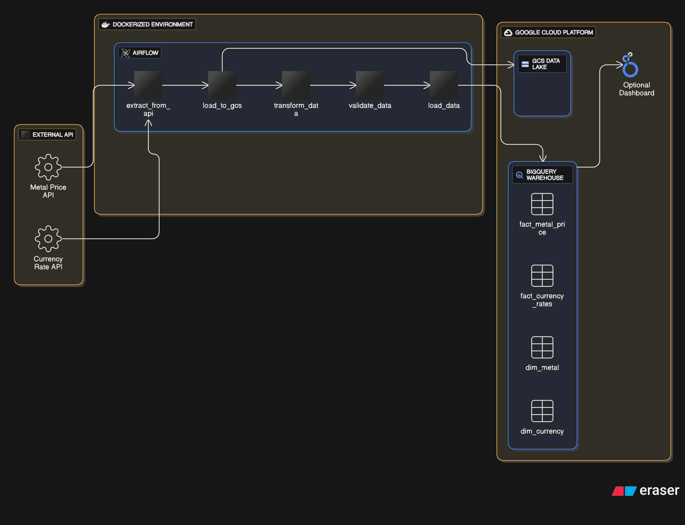
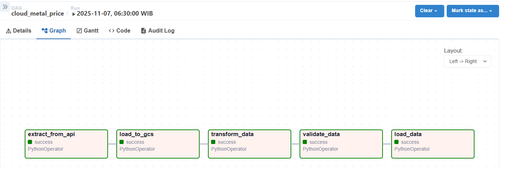
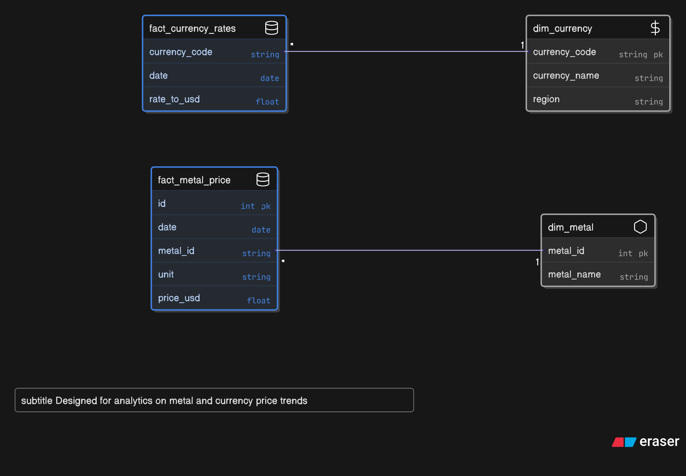
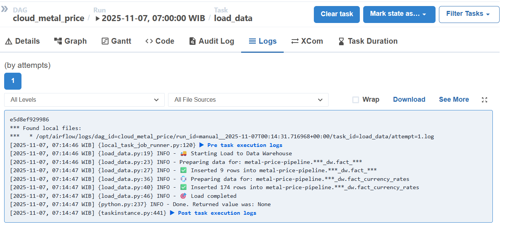

# ☁️ Metal Price Pipeline — End-to-End ETL with Airflow & GCP

## 📘 Overview

**Metal Price Pipeline** adalah proyek *end-to-end data engineering pipeline* yang dirancang untuk:
- Menarik data harga logam dan nilai tukar mata uang dari API eksternal.
- Melakukan transformasi dan validasi data.
- Menyimpan hasilnya ke **Google BigQuery** sebagai *Data Warehouse*.
- Mengotomatisasi seluruh proses menggunakan **Apache Airflow** di dalam **Docker Compose** environment.

Pipeline ini mencerminkan alur kerja *production-grade ETL* di dunia industri — mulai dari data ingestion, processing, sampai analitik-ready data delivery.

---

## 🧩 System Architecture


## ⚙️ Tech Stack

| Layer | Tool | Purpose |
|-------|------|----------|
| **Orchestration** | 🌀 Apache Airflow | Automasi & scheduling ETL pipeline |
| **Infrastructure** | 🐳 Docker Compose | Containerization environment |
| **Cloud Platform** | ☁️ Google Cloud Platform | Target penyimpanan & analitik |
| **Data Lake** | 🗃️ Google Cloud Storage | Menyimpan file mentah & hasil transformasi |
| **Data Warehouse** | 🧱 BigQuery | Menyimpan data terstruktur untuk analisis |
| **Language** | 🐍 Python (Poetry) | Data transformation, validation, dan integration |
| **Logging & Validation** | 🧩 Python logging + assertion | Menjaga integritas data antar tahap ETL |

---

## 🚀 Pipeline Flow

  

### DAG: `cloud_metal_price`

| Step | Task ID | Description |
|------|----------|-------------|
| 1️⃣ | `extract_from_api` | Ambil data logam & currency dari API eksternal |
| 2️⃣ | `load_to_gcs` | Simpan data mentah ke Google Cloud Storage |
| 3️⃣ | `transform_data` | Mapping ID, ubah struktur jadi format warehouse |
| 4️⃣ | `validate_data` | Validasi field penting (`date`, `price_usd`, `metal_id`) |
| 5️⃣ | `load_data` | Insert ke BigQuery tabel fakta `fact_metal_price` dan `fact_currency_rates` |

---

## 🧠 Data Model (Dimensional Schema)

  


### 📊 Fact Tables
- `fact_metal_price`  
  - `id`, `date`, `metal_id`, `unit`, `price_usd`
- `fact_currency_rates`  
  - `currency_code`, `date`, `rate_to_usd`

### 🧱 Dimension Tables
- `dim_metal`
  - Static mapping (gold → 1, silver → 2, dst.)
- `dim_currency`
  - Referensi kode mata uang

---

## 🧰 Key Features

✅ Modular tasks via PythonOperator  
✅ XCom data passing antar task  
✅ Validation sebelum load ke warehouse  
✅ Error logging terperinci (GCP insert logs)  
✅ Environment fully containerized  
✅ GCP integration tested (GCS + BigQuery)  

---

## 📂 Project Structure

```

metal-price-pipeline/
│
├── dags/
│   └── dag_metal_cloud.py              # DAG utama Airflow
│
├── src/
│   ├── create_dw.py                    # Pembuatan skema DW di BQ dan insert value tabel dimensi 
│   ├── extract_load_gcs.py             # Extract & load ke GCS
│   ├── transform_data.py               # Transformasi data API
│   ├── validate_data.py                # Validasi hasil transform
│   └── load_data.py                    # Load ke BigQuery
│
├── docker-compose.yml                  # Airflow + Postgres services
├── requirements.txt / pyproject.toml    # Poetry dependency
└── README.md

````

---

## 📦 Deployment Guide

1️⃣ **Build & Start Services**
```bash
docker compose up --build
````

2️⃣ **Access Airflow Web UI**

```
http://localhost:8080
```

Username: `airflow`
Password: `airflow`

3️⃣ **Trigger DAG**

```bash
airflow dags trigger cloud_metal_price
```

4️⃣ **Monitor Progress**

  

## 👨‍💻 Author

**Sanjukin Pinem**
🎓 Computer Science, Universitas Padjadjaran
💼 Aspiring Data Engineer | Python | Airflow | GCP | SQL

---